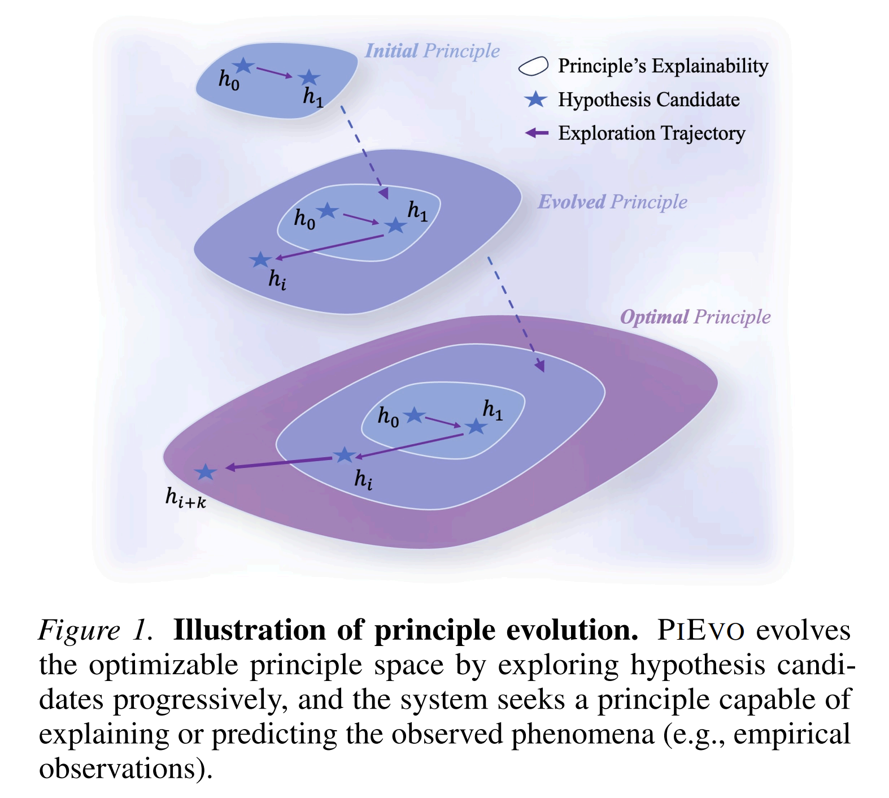

# PiEvo: Principle-Evolvable Scientific Discovery via Uncertainty Minimization

<div align="center">

### Official code release for our PiEvo research

**[Yingming Pu](https://dandelionym.github.io)** &emsp; **[Tao Lin](https://lins-lab.github.io/)** &emsp; **[Hongyu Chen](https://nanosynthesis.github.io/)**  
Westlake University

[](https://opensource.org/licenses/MIT)
[](https://www.python.org/downloads/)
[](https://github.com/microsoft/autogen)
[](https://arxiv.org/abs/2602.06448)

[Overview](#overview) •
[Highlights](#highlights) •
[Installation](#installation) •
[Quick Start](#quick-start) •
[Customization](#customization) •
[Citation](#citation)

</div>

---

## Overview

**PiEvo** is a multi-agent framework for scientific discovery that **evolves scientific principles, not only hypotheses**.

Instead of searching within a fixed hypothesis space, PiEvo treats discovery as **Bayesian optimization over an expanding principle space**. The system combines principle induction, hypothesis generation, and experimental evaluation in a closed-loop workflow, allowing the agent team to revise its scientific worldview as new evidence arrives.

This repository is the **official implementation** accompanying our `PiEvo` paper and is designed for **scientific researchers** interested in LLM-based autonomous discovery, principle-aware reasoning, and configurable multi-agent experimentation.

<div align="center">
  
</div>

---

## Why PiEvo?

Most LLM-based scientific agents operate under a **static prior**: they search for good candidates while keeping their underlying scientific assumptions fixed. PiEvo is built around a different premise:

> **When evidence contradicts the current worldview, the system should update the principle space itself.**

PiEvo therefore shifts the optimization target from isolated candidate proposals to a **compact, evolvable principle layer** that guides downstream hypothesis generation and experiment selection.

This makes the framework especially appealing for research settings where:

- the initial scientific prior may be incomplete,
- anomalies carry meaningful theoretical signal,
- efficient search matters as much as final performance,
- interpretability of the discovery process is valuable.

---

## Highlights

- **Principle-evolvable discovery loop** — PiEvo explicitly maintains and updates a set of scientific principles with beliefs, priors, and history-aware refinement.
- **Three specialized research agents** — a **Principle Agent**, **Hypothesis Agent**, and **Experiment Agent** collaborate in a structured submission-driven workflow.
- **Bayesian uncertainty minimization** — the framework uses Bayesian modeling and Gaussian-process-based reasoning to guide selection under uncertainty.
- **Anomaly-aware principle augmentation** — surprising observations can trigger refinement or expansion of the current principle space.
- **Config-driven experimentation** — task definitions, model backends, and agent behavior are organized through YAML configuration.
- **Pluggable domain tools** — experiment execution can be extended through registered tools under `pievo/tools/`.
- **Traceable runs and artifacts** — PiEvo records submissions, notes, histories, and metrics during execution.
- **Optional web visualization** — a lightweight Flask-based interface can be launched to inspect runtime progress.

---

## Results at a Glance

As reported in the paper, PiEvo demonstrates strong empirical performance across four scientific discovery benchmarks:

- **up to 29.7%–31.1% improvement** over prior state-of-the-art baselines,
- **up to 83.3% faster convergence** through reduced sample complexity,
- **robust performance across diverse scientific domains and model backbones**.

For full experimental details, please refer to the paper: **[Principle-Evolvable Scientific Discovery via Uncertainty Minimization](https://arxiv.org/abs/2602.06448)**.

---

## System Architecture

PiEvo organizes discovery as a structured multi-agent research process:

### 1. Principle Agent

Proposes or refines scientific principles that capture the deeper laws, mechanisms, or patterns relevant to the task.

### 2. Hypothesis Agent

Generates concrete, testable candidates grounded in the active scientific principles.

### 3. Experiment Agent

Evaluates selected candidates using configured tools and returns structured outcomes.

### 4. Principle-Space Update

PiEvo updates beliefs over principles, tracks anomalous observations, and uses the accumulated evidence to guide future exploration and exploitation.

This design makes PiEvo more than a prompt chain: it is a **research workflow engine** for principle-aware scientific search.

---

## Installation

### Recommended environment

PiEvo requires **Python 3.10+**. We recommend using the provided Conda environment:

```bash
git clone https://github.com/amair-lab/PiEvo.git
cd PiEvo

conda env create -f environment.yml
conda activate pievo
pip install -e .
```

### Core dependencies

The project is built around:

- `autogen-agentchat==0.7.4`
- `autogen-core==0.7.4`
- `autogen-ext[openai]==0.7.4`
- `numpy`, `scipy`, `scikit-learn`
- `flask`, `matplotlib`, `seaborn`, `pandas`

See [pyproject.toml](pyproject.toml) and [environment.yml](environment.yml) for the full dependency list.

---

## Quick Start

### 1. Configure your models

Set the model and API information in [config/model.yaml](config/model.yaml).

### 2. Run PiEvo

```bash
python -m pievo.main \
    --task_config config/task.yaml \
    --model_config config/model.yaml \
    --output_dir ./outputs \
    --max_turn 20
```

You can also use the installed CLI entrypoint:

```bash
pievo \
    --task_config config/task.yaml \
    --model_config config/model.yaml \
    --output_dir ./outputs \
    --max_turn 20
```

### 3. Launch the visualization interface (optional)

```bash
python -m pievo.main \
    --task_config config/task.yaml \
    --model_config config/model.yaml \
    --output_dir ./outputs \
    --max_turn 20 \
    --visualization
```

This starts a local Flask server for inspecting runtime status, principles, logs, and history during execution.

---

## Runtime Arguments

- `--task_config`: path to the YAML file defining the scientific task.
- `--model_config`: path to the YAML file defining agent prompts and model backends.
- `--output_dir`: directory for saved submissions, notes, caches, and logs.
- `--max_turn`: maximum number of turns in the multi-agent session.
- `--visualization`: enable the local web interface.
- `--off_pievo`: disable PiEvo-specific strategy components for ablation-style runs.

Additional research and tuning arguments are available in [pievo/main.py](pievo/main.py).

---

## Customization

PiEvo is designed as a research framework rather than a single fixed demo.

### Define a new task

Edit [config/task.yaml](config/task.yaml) to describe:

- the scientific objective,
- parameter or candidate space,
- target metrics,
- initial experimental history,
- environment variables for auxiliary services.

### Configure agent behavior

Edit [config/model.yaml](config/model.yaml) to customize:

- agent system prompts,
- model endpoints,
- temperatures and token limits,
- JSON output behavior,
- tool access per agent.

### Add or replace experimental tools

Extend the registry in [pievo/tools/](pievo/tools/) by adding decorator-registered tools for your domain.

This makes PiEvo adaptable to a broad range of scientific discovery settings, from toy optimization tasks to domain-specific computational workflows.

---

## Repository Structure

```text
PiEvo/
├── config/              # Task and model configuration
├── pievo/agents/        # Agent implementations
├── pievo/group/         # Multi-agent orchestration and PiEvo strategy
├── pievo/tools/         # Pluggable experiment tools
├── pievo/word/          # Bayesian modeling, prompts, extraction, embeddings
├── pievo/templates/     # Visualization templates
├── pievo/server.py      # Local visualization server
├── environment.yml      # Recommended Conda environment
└── README.md
```

---

## Positioning

PiEvo is best understood as a framework for **principle-aware autonomous scientific discovery**:

- not only searching for better candidates,
- but also **learning which scientific principles deserve belief**,
- and using that evolving principle space to drive more efficient downstream exploration.

If your research cares about **theory-guided agentic discovery**, **interpretable scientific reasoning**, or **adaptive prior revision under uncertainty**, PiEvo is built for that regime.

---

## Related Work

PiEvo extends our broader line of work on principle-aware multi-agent scientific discovery. For background and related ideas, see:

- **PiEvo**: [Principle-Evolvable Scientific Discovery via Uncertainty Minimization](https://arxiv.org/abs/2602.06448)
- **PiFlow**: [Principle-Aware Scientific Discovery with Multi-Agent Collaboration](https://github.com/amair-lab/PiFlow)

---

## Citation

If you find PiEvo useful in your research, please cite:

```bibtex
@misc{pu2026pievo,
  title={Principle-Evolvable Scientific Discovery via Uncertainty Minimization},
  author={Yingming Pu and Tao Lin and Hongyu Chen},
  year={2026},
  eprint={2602.06448},
  archivePrefix={arXiv},
  primaryClass={cs.LG},
  url={https://arxiv.org/abs/2602.06448},
}

@misc{pu2025piflow,
  title={PiFlow: Principle-Aware Scientific Discovery with Multi-Agent Collaboration},
  author={Yingming Pu and Tao Lin and Hongyu Chen},
  year={2026},
  eprint={2505.15047},
  archivePrefix={arXiv},
  primaryClass={cs.LG},
  url={https://arxiv.org/abs/2505.15047},
}
```

---

## License

This project is released under the MIT License. See [LICENSE](LICENSE) for details.
